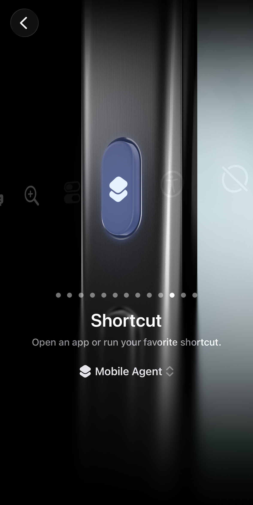
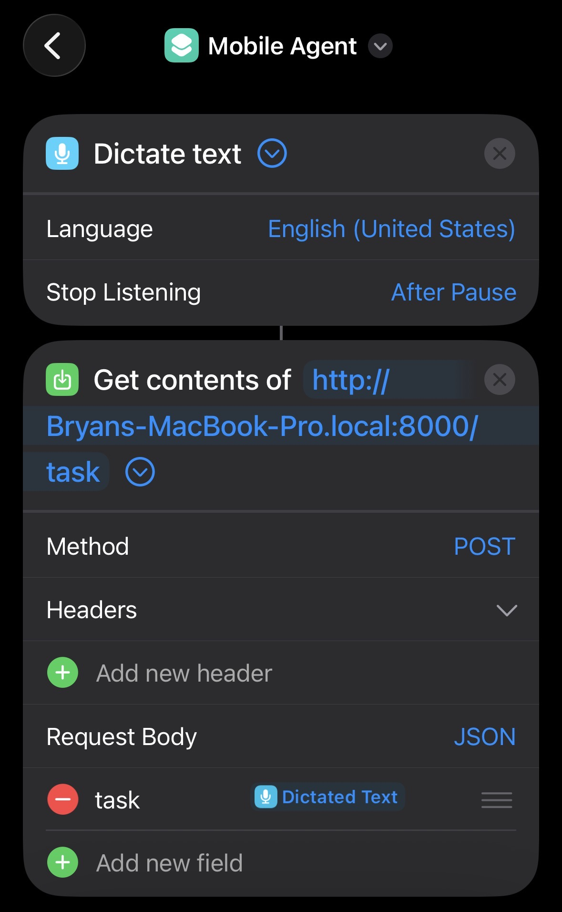

# 📱 Agentic Phone Automation

*Voice-controlled AI agent that operates your physical iPhone — automate any app with natural language.*

> "Hey, search for the best tacos near me on Google" — and watch your phone do it autonomously.

**[Demo + Presentation Slides (4 min)](https://youtu.be/6s_JOBAuCBI)** · **[Quick Screen-Recorded Demo (30 sec)](https://youtube.com/shorts/vuj-UIx9TCo?feature=share)**

---

## What is Agentic Phone Automation?

Browser agents exist. On iOS, the closest equivalent is Siri — but it's extremely limited to single-step commands and Apple's own ecosystem. **We built a fully autonomous AI agent that controls a physical iPhone**, performing complex multi-step workflows across *any* installed app — not just Apple's.

Hold the **Action Button**, speak a command, and the agent takes over: it sees your screen, reasons about the next step, taps and types through the UI, and shows real-time progress in the **Dynamic Island**. When it's unsure, it asks you.

```bash
# That's it. Speak and watch.
node agent.mjs "open Spotify and play lofi beats" --phone --provider openai
```

---

## 🚀 How It Works

The agent follows an **observe-decide-act** loop on a physical iPhone over USB:

```
  Action Button 🎤 → "Search for USC on Maps"
         │
         ▼
  ┌──────────────────────────────────────┐
  │            MacBook                   │
  │                                      │
  │  Frontend Server ← voice command     │
  │       ↓                              │
  │  agent.mjs ↔ GPT-5.4 / Gemini API    │
  │       ↓                              │
  │  Direct HTTP (100ms/action)          │
  │       ↓                              │
  │  Maestro Bridge (USB tunnel)         │
  └───────┬──────────────────────────────┘
          │ USB Cable
  ┌───────▼──────────────────────────────┐
  │          iPhone 15 Pro               │
  │                                      │
  │  XCTest Runner (HTTP server)         │
  │    → real taps, typing, screenshots  │
  │                                      │
  │  Dynamic Island → live progress      │
  └──────────────────────────────────────┘
```

Each step: **Screenshot (162ms) → AI decides (1-3s) → Execute action (100ms) → Repeat**

---

## 🎯 Key Features

<p align="center">
  
</p>
<p align="center">
  <em>Hold the Action Button and speak your command — the shortcut captures your voice and sends it to the agent.</em>
</p>

<p align="center">
  
  &nbsp;&nbsp;&nbsp;
  
</p>
<p align="center">
  <em>Left: Dynamic Island shows real-time agent status — current task, step count, elapsed time, and a stop button to cancel anytime. Right: Human-in-the-loop — the agent asks for confirmation before sending a message, with options to approve, reject, or cancel.</em>
</p>

- **20+ tools** available to the AI — tap, type, scroll, swipe, launch any app, take screenshots, read UI elements, web search
- **Voice-triggered** via iPhone Action Button — hold and speak, agent handles the rest
- **Dynamic Island** — real-time progress with step count, phase indicators, and agent reasoning
- **Human-in-the-loop** — agent asks before sending messages, deleting data, or making purchases
- **Web search** — agent can search the web (via Brave API) to understand unfamiliar apps, look up answers, or gather context mid-task
- **Auto-bundled UI elements** — every screenshot includes the full view hierarchy with exact coordinates, so the AI taps with pixel-perfect accuracy from the accessibility tree instead of guessing from images
- **Smart stuck detection** — detects coordinate clusters and unchanged screens, suggests web search when the agent doesn't understand an app
- **CoAT screen reasoning** — structured 4-step analysis (describe screen → read text → identify elements → determine interaction) before acting on unfamiliar interfaces
- **Multi-step workflows** — navigate across any installed app, not limited to Apple apps
- **Context-aware** — understands what's on screen via view hierarchy + vision
- **Multi-provider** — switch between OpenAI (GPT-5.4) and Google (Gemini 2.5 Flash-Lite)
- **Research-backed accuracy** — grid overlay, ZoomClick, screenshot compression grounded in published papers

---

## 🛠️ Tech Stack

| Layer | Technology |
|-------|-----------|
| **Agent Runtime** | Node.js (ES modules) |
| **Vision LLM** | OpenAI GPT-5.4 / Gemini 2.5 Flash-Lite |
| **Device Control** | Maestro + XCTest (Direct HTTP over USB) |
| **Dynamic Island** | Swift, SwiftUI, ActivityKit |
| **Frontend** | HTML/CSS/JS, WebSocket |
| **Image Processing** | Sharp (grid overlay, compression) |
| **USB Communication** | pymobiledevice3 (fallback screenshots) |

---

## 📊 Performance & Benchmarks

### Semantic Context Optimization (SecAgent-inspired)

Single-image mode with rolling text summaries achieves **3.4x speedup** over baseline while reducing token usage by 30%:

| Mode | Input Tokens | Speedup | Description |
|------|-------------|---------|-------------|
| **Baseline** | 44,415 | 1.00x | All screenshots kept in history |
| **Single-Image** | 31,209 | 3.40x | Latest screenshot + rolling text summary |

`Sₜ = Sₜ₋₁ + Aₜ₋₁ + Flattened_UIₜ`

### Direct HTTP vs Maestro CLI

By reverse-engineering the XCTest HTTP protocol, we eliminated JVM startup overhead:

| Action | Maestro CLI | Direct HTTP | Speedup |
|--------|-----------|-------------|---------|
| Tap | 3-4s | 380ms | **10x** |
| Launch App | 4-5s | 41ms | **100x** |
| Press Key | 6-7s | 50ms | **100x** |
| Screenshot | N/A | 162ms | — |
| Input Text | 6-7s | 2.7s | **2.5x** |

### Agent Loop Optimization (measured across 6 runs)

Iterative optimization of the agent loop on the same task ("Text Emiliano what school I go to"), fixing one failure at a time:

| Run | Steps | Time | Key Fix |
|-----|-------|------|---------|
| 1 (original) | 12+ (failed) | 83s+ | — |
| 2 | 6 | 33.9s | Removed 26s Maestro CLI fallback |
| 3 | 9 | 50.3s | AI behavior variance |
| 4 | 5 | 23.6s | Auto-bundled UI coordinates |
| 5 | 6 | 38.9s | Hierarchy-based send button |
| 6 (final) | **4** | **23.9s** | All fixes combined |

**3.5x faster, 3x fewer steps.** 4 steps is the theoretical minimum for this task. See [`docs/agent-loop-optimization.md`](docs/agent-loop-optimization.md) for the full analysis.

Key optimizations:
- **Auto-bundled UI elements** — every screenshot includes view hierarchy with exact coordinates (parallel fetch via `Promise.all`)
- **Smart settle delay** — 350ms after navigation actions only (matches iOS animation durations: nav push 330ms, keyboard 250ms)
- **Hierarchy-based send** — `typeAndSubmit` finds the send button dynamically instead of using hardcoded coordinates
- **Semantic stuck detection** — catches coordinate clusters within 10% range, not just exact duplicates

### Web Search for Unfamiliar Apps

The agent uses Brave Search API to understand apps it hasn't seen before. Tested on LinkedIn Pinpoint (a word puzzle game):

| Metric | Without web search | With web search |
|--------|-------------------|-----------------|
| Steps | 6+ (looping forever) | 5 (completed) |
| Behavior | Tapped static clue labels | Searched answer, typed guess, submitted |
| Result | Never completed | Solved in 23.4s |

The web search call takes 0.6s and returns results inline — the agent reads them without opening Safari. See [`docs/web-search-tool.md`](docs/web-search-tool.md).

### Grounding Accuracy Modes

Three research-backed approaches to reduce the #1 failure in GUI agents — wrong tap coordinates:

| Mode | Based On | Expected Improvement |
|------|----------|---------------------|
| `baseline` | Raw screenshot | Control group |
| `grid` | AppAgent (Tencent, CHI 2025) | ~20-30% fewer wrong taps |
| `zoomclick` | ZoomClick (Princeton, 2025) | +48pp on small targets |

---

## 🏗️ Architecture

### Agent Tool System

```
Screenshot → AI → Pick Tool → Execute → Repeat
                     │
           ┌─────────┼──────────┐
           ▼         ▼          ▼
         Touch     Vision     Safety
         ─────     ──────     ──────
         tap       screenshot  askUser
         type      getUI       done
         scroll    zoomTap     fail
         swipe
         openApp
```

### Three Agent Modes

| Mode | Strategy | Token Usage | Speed |
|------|----------|-------------|-------|
| **Baseline** | Keep all screenshots | High | Slow |
| **Single-Image** (default) | Latest screenshot + text summaries | Low | 3.4x faster |
| **Vision-Gated** | Hash-based — skip screenshots when UI unchanged | Lowest | Fastest |

### iOS Companion App

The MobileAgentCompanion app runs on your iPhone and provides three tabs:

| Tab | What it shows |
|-----|---------------|
| **Status** | Real-time agent progress — task name, step count, phase (Thinking/Acting/Observing), agent thought, progress bar. Updates every 500ms |
| **History** | All completed tasks grouped by day — task name, summary, steps, time, model. Cached locally for offline viewing |
| **Memory** | Facts the agent has learned about you — view, edit, or delete any fact. Clean up duplicates and stale data directly from your phone |

The app also powers the **Dynamic Island** — live progress, stop button, and human-in-the-loop responses. See [`docs/companion-app.md`](docs/companion-app.md) for full details.

History and memories are **cached locally** on the phone. Previously synced data is visible even when disconnected from the Mac. The app syncs new data whenever you switch tabs or pull to refresh.

### Simulator vs Physical Device

| Capability | Simulator | Physical iPhone |
|------------|-----------|----------------|
| Launch app | instant | 41ms (Direct HTTP) |
| Deep links | instant | Not supported |
| Screenshots | instant | 162ms (XCTest HTTP) |
| Tap/type | 1-3s (MCP) | 100-380ms (Direct HTTP) |
| Dark mode | instant | Not supported |
| GPS location | instant | Not supported |

---

## 🚀 Getting Started

### Prerequisites

- **Node.js** 18+
- **macOS** with Xcode
- **OpenAI API Key** or **Gemini API Key**
- **Maestro CLI** + **Java** (OpenJDK)
- **Physical iPhone** (14+ for Dynamic Island) connected via USB

### Installation

```bash
git clone https://github.com/bryanrg22/Agentic-Phone-Automation.git
cd Agentic-Phone-Automation

npm install

# Set API keys
echo "OPENAI_API_KEY=your_key" > .env
echo "GEMINI_API_KEY=your_key" >> .env

# Install Maestro
curl -Ls "https://get.maestro.mobile.dev" | bash
brew install openjdk
```

### Physical iPhone Setup (one-time)

1. **On your iPhone:**
   - Settings → Privacy & Security → **Developer Mode** → Enable (restart required)
   - Settings → Developer → **Enable UI Automation**

2. **Install the Maestro iOS device bridge:**
   ```bash
   curl -fsSL https://raw.githubusercontent.com/devicelab-dev/maestro-ios-device/main/setup.sh | bash
   ```

3. **Get your device info:**
   ```bash
   xcrun xctrace list devices          # Find your UDID
   ```

4. **First-time bridge setup** (builds & deploys XCTest runner to phone):
   ```bash
   export PATH="/opt/homebrew/opt/openjdk/bin:$PATH:$HOME/.maestro/bin"
   maestro-ios-device --team-id YOUR_TEAM_ID --device YOUR_UDID
   ```
   - On first run: go to Settings → General → VPN & Device Management → **Verify** the developer app
   - The bridge builds the XCTest runner (~1-2 min first time), then stays running

5. **Set up the Action Button shortcut** (enables voice-triggered tasks):

   Install the shortcut directly: **[Mobile Agent Shortcut](https://www.icloud.com/shortcuts/9dad98f830af44118ee0d20e4503235e)** — open this link on your iPhone (or Mac, it syncs) and tap **Add Shortcut**.

   Then assign it to your Action Button:

   <p align="center">
     
     &nbsp;&nbsp;&nbsp;&nbsp;
     
   </p>
   <p align="center">
     <em>Left: Settings → Action Button → Shortcut → select "Mobile Agent". Right: The shortcut dictates your voice, then sends it as a POST request to your Mac's frontend server.</em>
   </p>

   **What the shortcut does:** Dictate Text → POST the transcription as JSON to `http://<your-mac>.local:8000/task`. Replace `Bryans-MacBook-Pro.local` with your Mac's hostname (System Settings → General → Sharing → Local Hostname). Your iPhone and Mac must be on the same Wi-Fi network.

### Running on Physical iPhone

```bash
# Terminal 1: Maestro bridge (USB tunnel — keep running)
export PATH="/opt/homebrew/opt/openjdk/bin:$PATH:$HOME/.maestro/bin"
maestro-ios-device --team-id YOUR_TEAM_ID --device YOUR_UDID

# Terminal 2: Frontend server (voice + Dynamic Island)
node frontend/server.mjs --provider openai
```

Then hold the **Action Button** and speak your command.

### Simulator Setup (one-time)

1. **Xcode** must be installed (includes iOS Simulator)
2. **Boot a simulator:**
   ```bash
   xcrun simctl boot "iPhone 17 Pro"
   open -a Simulator
   ```

### Running on Simulator

```bash
# Single command — no bridge needed
node agent.mjs "search for USC on Maps" --provider openai
```

### CLI Options

```bash
node agent.mjs "your task" \
  --phone                              # Physical iPhone mode
  --provider openai|gemini             # LLM provider
  --model gpt-5.4                      # Specific model
  --max-steps 15                       # Step limit
  --agent-mode single-image|baseline|vision-gated
  --grounding baseline|grid|zoomclick  # Coordinate accuracy mode
  --compress                           # Screenshot compression (8MB → 150KB)
```

---

## 📚 Research Foundation

This project implements techniques from published research:

| Paper | Venue | What We Use |
|-------|-------|-------------|
| **SecAgent** | arXiv 2025 | Semantic context — rolling text summaries replace stacked screenshots |
| **CoAT** | EMNLP 2024 | Structured screen reasoning before every action (describe → read → identify → act) |
| **MobileRAG** | arXiv 2025 | Inspiration for web search integration — RAG for mobile agents |
| **AppAgent** | Tencent, CHI 2025 | Grid overlay for spatial grounding |
| **ZoomClick** | Princeton, 2025 | Iterative zoom for precise small-target tapping |
| **ScreenSpot-Pro** | arXiv 2025 | Screenshot compression — higher res hurts, not helps |
| **OmniParser** | Microsoft, 2024 | Set-of-Marks inspiration for element labeling |
| **GUI-Actor** | NeurIPS 2025 | Understanding why coordinate prediction fails structurally |
| **Adaptive-RAG** | NAACL 2024 | When to retrieve external knowledge vs. act on existing knowledge |

---

## 🤔 Why This Exists

**Apple refuses to update Siri for the agentic world.** In 2026, we have AI models that can reason, plan multi-step workflows, and use tools — yet Siri still can't do anything beyond single-step commands in Apple's own apps. It can't play a LinkedIn game. It can't check the weather in one app and text it from another. It can't navigate third-party apps at all.

The obvious solution would be to give developers access to the same system APIs Siri uses — `INSendMessageIntent`, the Contacts database, deep system integration. But Apple locks these down. Siri can send a message with one API call; we have to open Messages, find the contact, tap the text field, type, and hit send. The only thing limiting this agent is what Apple has locked away so that everyday developers can't build a better version of their software.

So we built around it. The **Action Button workaround** — holding the physical button to speak a command that routes through a Shortcut to our agent — is a creative bypass that turns any iPhone 15+ into a voice-controlled AI agent. No jailbreak, no private APIs, no App Store approval needed. Just a Shortcut, a Mac on the same Wi-Fi, and a USB cable.

| What Siri Gets | What We Get |
|----------------|-------------|
| Private system APIs (Contacts, Messages, Calendar) | UI automation only (taps, types, scrolls) |
| One API call to send a message | 5-6 UI steps to send a message |
| Direct contact resolution | Navigate Contacts app or use memory |
| Apple-only apps | **Any installed app** |
| Single-step commands | **Multi-step autonomous workflows** |
| No third-party app support | **Full third-party app support** |
| No web search | **Real-time web search (Brave API)** |
| No learning from past tasks | **Episodic + semantic memory** |

Even with these limitations, the agent does things Siri cannot: multi-app workflows (check weather → text it to a friend), playing games autonomously, navigating any third-party app, learning from past interactions, and searching the web for context mid-task.

Building this system required reverse-engineering the XCTest HTTP protocol, patching Maestro's iOS device bridge, implementing research techniques from 8+ papers, and designing a complete agent loop with memory, stuck detection, and human-in-the-loop — all because Apple won't open the door that would make this trivial.

---

## 🔮 Future Vision

This project demonstrates that **physical device automation is not only possible but practical**. The techniques here — Direct HTTP to XCTest, semantic context compression, research-backed grounding — form a foundation for a new category of mobile AI agents.

### 🔍 Next Steps

1. **Human-in-the-loop redesign** — skip confirmation for explicit commands, only ask for ambiguous or high-stakes actions
2. **Round trip reduction** — chain multiple tool calls per AI step
3. **Screenshot compression** — resize before sending (8MB → 150KB, same accuracy)
4. **OmniParser integration** — numbered element labels for zero-coordinate-error tapping
5. **Cross-platform** — extend Direct HTTP approach to Android via UIAutomator

---

## 👤 Author

**Bryan Ramirez-Gonzalez**

- [GitHub](https://github.com/bryanrg22)
- [LinkedIn](https://linkedin.com/in/bryanrg22)

Built at Yale · March 2026
